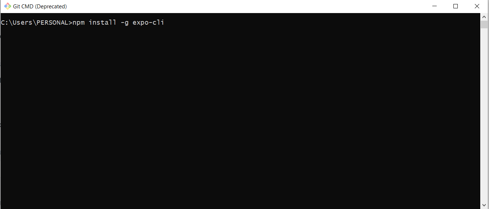
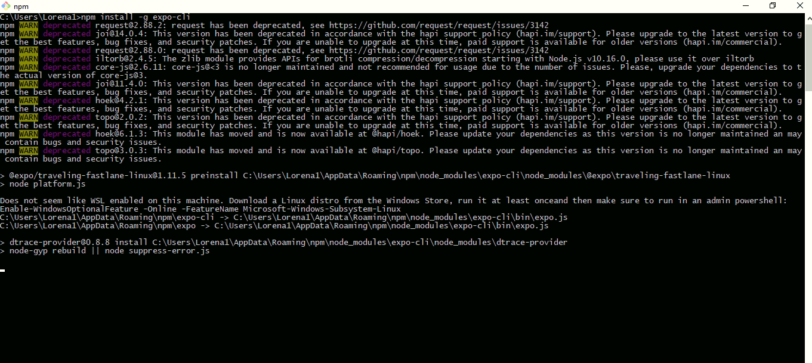
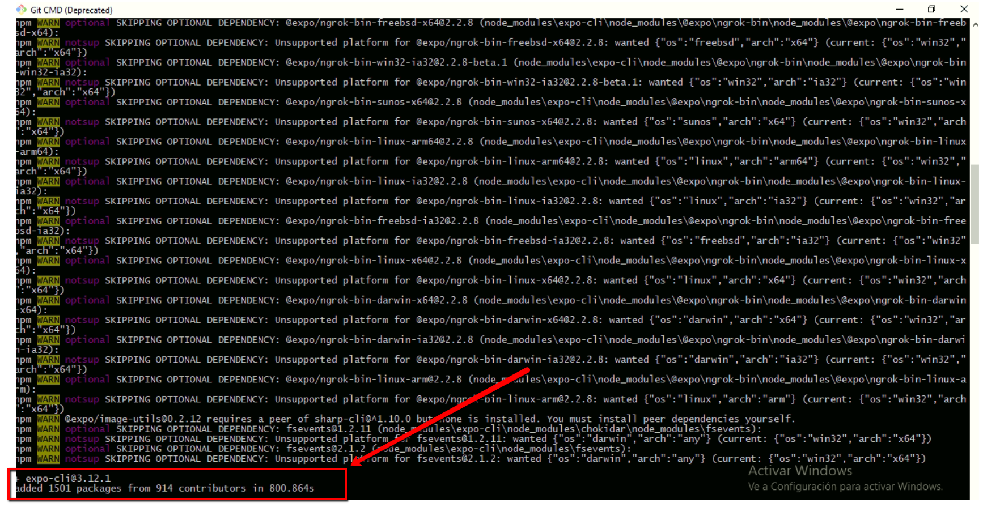
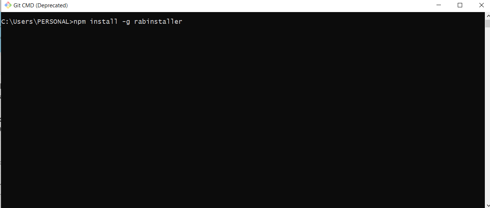

# Configuración del entorno

Necesitará Node, Expo, RAB IInstaller

1. Instalar node y npm: descárguelo Para Windows [aquí.](https://nodejs.org/download/release/v10.16.0/node-v10.16.0-x64.msi) Mac [Aqui](https://nodejs.org/download/release/v10.16.0/node-v10.16.0.pkg)
2. Instalar Git [Aqui](https://git-scm.com/downloads)
3. Descargar la carpeta para la compilación Manual [Aqui](http://academiadeapps.com/cursoapps/ios/builder.zip)
4. Registrarse en [https://expo.io/](https://expo.io/)

### Instalar Expo

Abrir la aplicacion Instalada **Git** 

Se abrirá una ventana de comando donde copiamos el siguiente código **\(** _****npm install -g expo-cli_\)

                                                              **Comenzara a instalarse los componentes**

                                              **Al finalizar la instalación se vera como en la siguiente imagen**

### Instalar RAB Installer

En Git copiamos el siguiente código **\(**npm install -g rabinstaller\) y presionamos Enter, se instalara los paquetes necesarios.

\*\*\*\*

