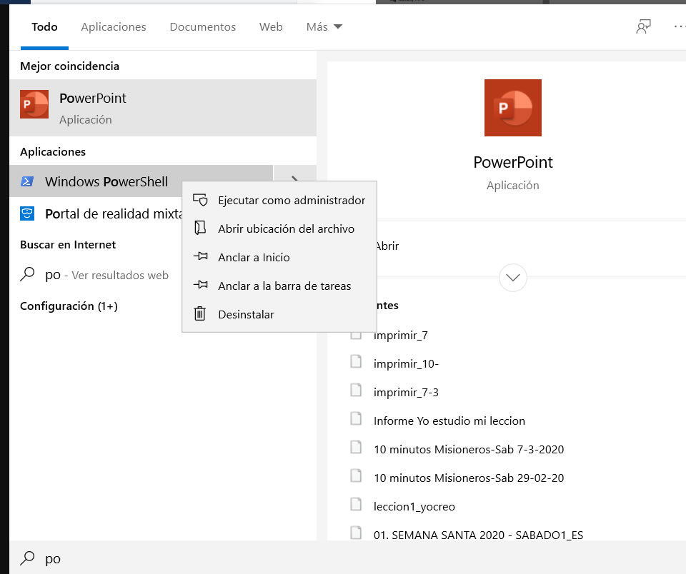
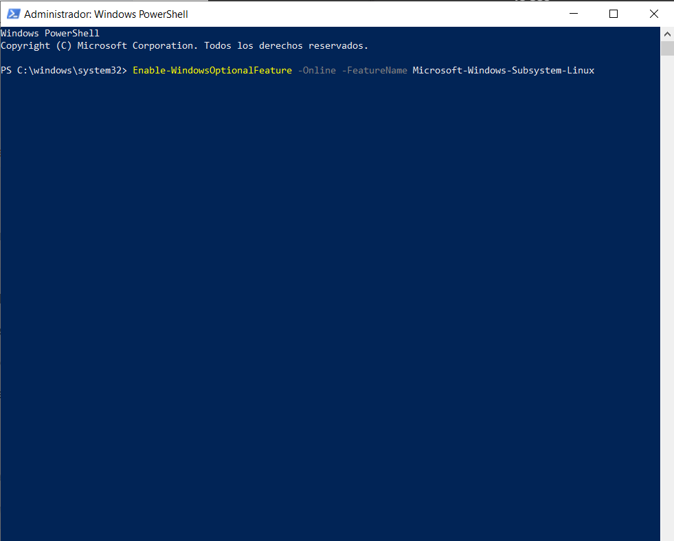
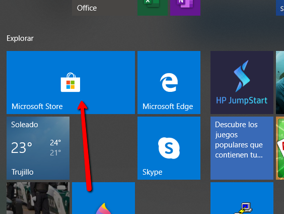
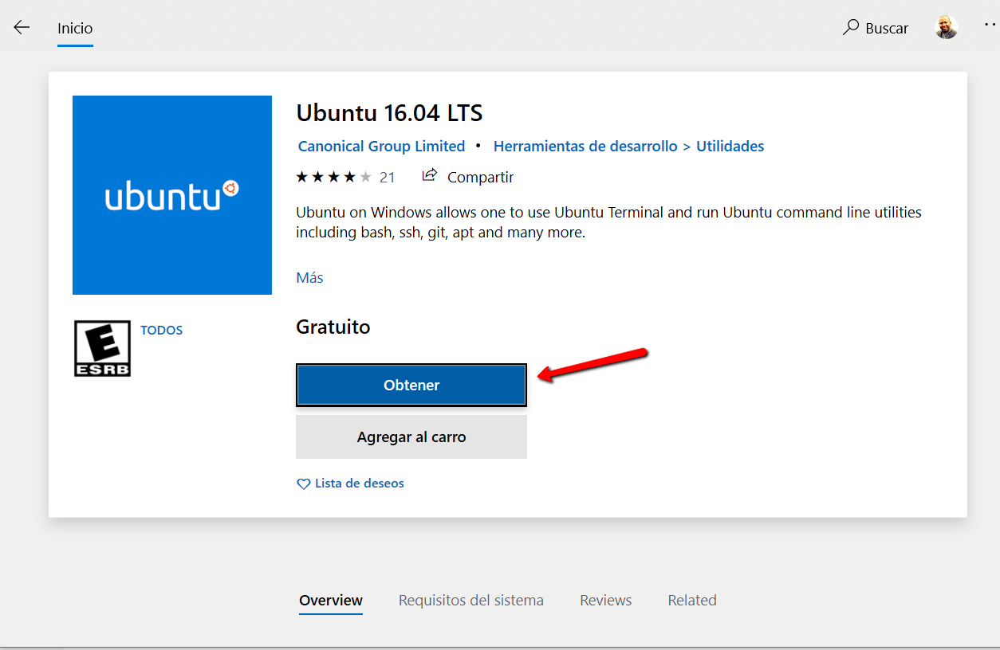

# Configuración del entorno

Necesitará Node, Expo, RAB IInstaller

1. Instalar node y npm: descárguelo Para Windows [aquí.](https://nodejs.org/download/release/v10.16.0/node-v10.16.0-x64.msi) Mac [Aqui](https://nodejs.org/download/release/v10.16.0/node-v10.16.0.pkg)
2. Instalar Git [Aqui](https://git-scm.com/downloads)
3. Descargar la carpeta para la compilación Manual [Aqui](http://academiadeapps.com/cursoapps/ios/builder.zip)
4. Registrarse en [https://expo.io/](https://expo.io/)
5. instalar NPM en carpeta Mobile App
6. Habilite el subsistema de Windows para Linux \(solo para los que trabajan con iOS\)
7. instalar ubuntu desde Microsoft store \(solo para los que trabajan con iOS\)

### Instalar Expo

Abrir la aplicacion Instalada **Git** 

Se abrirá una ventana de comando donde copiamos el siguiente código **\(** _****npm install -g expo-cli_\)

                                                              **Comenzara a instalarse los componentes**

                                              **Al finalizar la instalación se vera como en la siguiente imagen**

### Instalar RAB Installer

En Git copiamos el siguiente código **\(**npm install -g rabinstaller\) y presionamos Enter, se instalara los paquetes necesarios.

## instalar NPM en carpeta Mobile App



### Habilite el subsistema de Windows

Ejecutamos PowerShell desde Windows en modo Administrador

Al Abrirse ejecutamos el siguiente código y tecleamos Enter.`Enable-WindowsOptionalFeature -Online -FeatureName Microsoft-Windows-Subsystem-Linux`

Esperamos que descargue los componentes, nos preguntara si queremos reiniciar le decimos que si tecleando\(y\)

## Instalar ubuntu desde Microsoft store

Click en obtener y luego instalar, se abrirá la consola de windows automaticamente, donde instalara los componentes, puede tardar varios minutos, le pedirá un **usuario y contraseña Unix**, puede crear uno, y con eso se termina el proceso.

