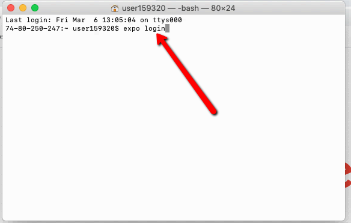

# Entorno Mac

1. Instalar node y npm: descárguelo Para Mac [Aqui](https://nodejs.org/download/release/v10.16.0/node-v10.16.0.pkg)
2. Descargar la carpeta para la compilación Manual [Aqui](http://academiadeapps.com/cursoapps/ios/builder.zip), guardar y extraer en **Documents**
3. Registrarse en [https://expo.io](https://expo.io/)

## Trabajando con Terminal

Abrimos el programa Terminal

1. **Instalar Expo**: escribir el siguiente comando en terminal \(`sudo npm install -g expo-cli)` 
2. ingresamos la contraseña del equipo mac cuando lo pregunte el sistema.

Proceso de Instalación de Expo.

3. **Instalar RAB Installer** \( `sudo npm install -g rabinstaller` \)

Proceso de instalación del Rab Installer

## Instalando NPM Install en el directorio Builder/Mobile App

Abrimos terminal, y ejecutamos `cd documents`

Luego ejecutamos `cd builder`

Ejecutamos cd "Mobile App"

Escribimos `sudo npm install` esperamos unos minutos que se instalen los componentes, es importante verificar que se instale en la carpeta **Mobile App** tal como muestra la ruta de la imagen.

Luego de instalar NPM iniciamos sesión en terminal con el siguiente comando **`expo login`** escribimos el usuario y contraseña con el que nos registramos en expo.

