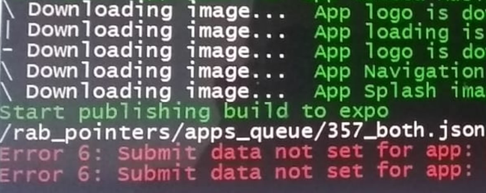
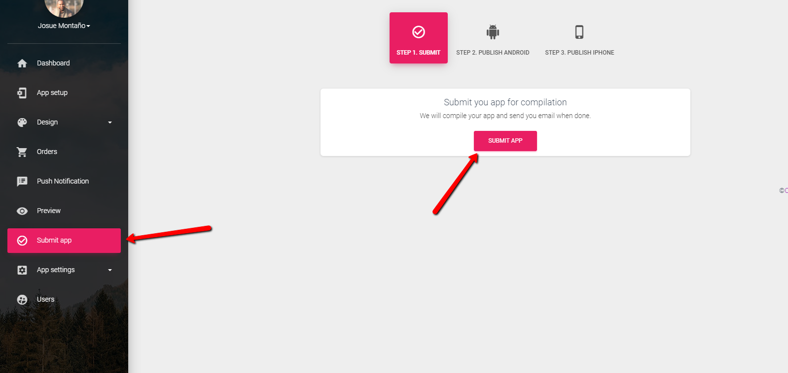

# Solución al error \#6 Submit data not set

### Solución 

El error numero 6 Submit data not set for app, se corrige enviando la aplicación desde el constructor antes de compilar la app, tal como muestra la imagen.

