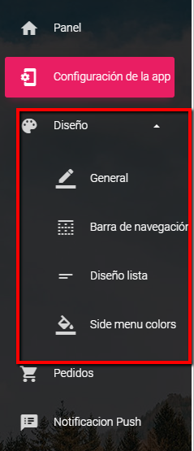

# Diseño de la aplicación

Al hacer clic en Diseño, allí puede configurar el diseño de su aplicación. Puede configurar el diseño de toda la aplicación, por lo que puede realizar cambios en:

* **General** - aquí puede cambiar el color de la aplicación, agregar una imagen de fondo, color de botón, texto de botón, etc.
* **Barra de Navegacion**- configurar el diseño de la barra de navegación como color de fondo, color de borde, etc.
* **Diseño de lista**- configurar el diseño de la lista
* **Colores del menu**- elige el color para tu menú

