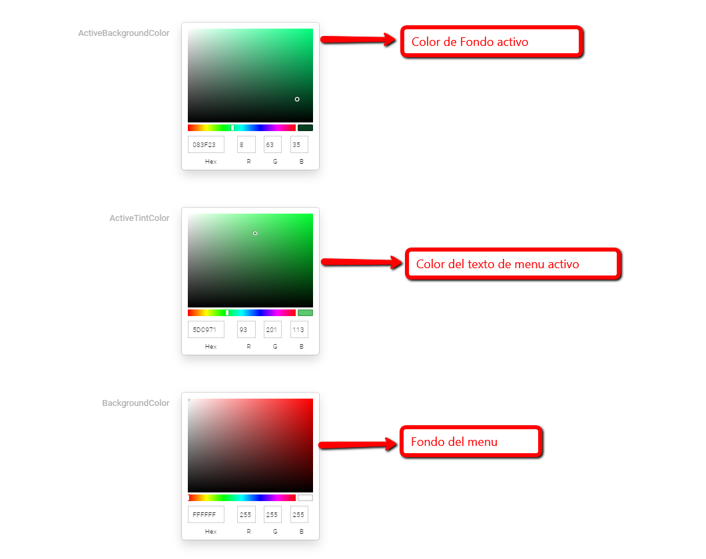
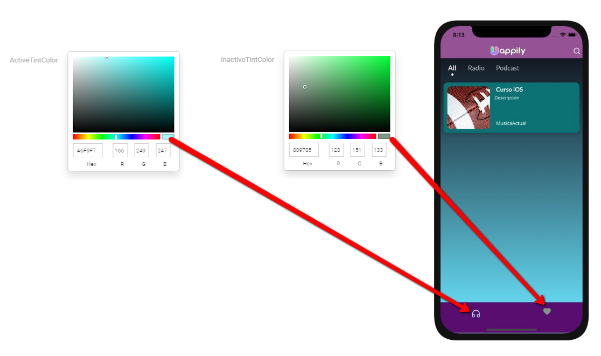

# Colores del menu

En esta sección puede editar los colores de los iconos o texto del menu tanto lateral como de pestaña

**ActiveTintColor:** cuando el Boton esta activo en una ventana muestra este color

**InactiveTintColor:** Cuando el Boton no esta activo muestra este color

