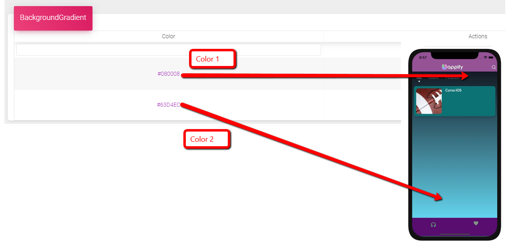

# Diseño-Sección General

\*\*\*\*

**Color de fondo** Puedes elegir el color de Fondo de la app, tal como se muestra en la imagen, si eliges colores oscuros, los iconos deben ser colores claros.

**Color gradiente de Fondo:** Puedes ingresar dos códigos de colores Hexadecimal, para tener un efecto degrado, si usas el mismo código dos veces se vera 1 solo color de fondo

**Color gradiente detalle:** Puedes ingresar dos códigos de colores Hexadecimal, para tener un efecto degrado, si usas el mismo código dos veces se vera 1 solo color de fondo

**Recursos de colores:** Puedes ingresar en [https://htmlcolorcodes.com/es/](https://htmlcolorcodes.com/es/) y elegir el color que desees, copias el codigo HEX y luego incorporarlo en la aplicación del constructor

