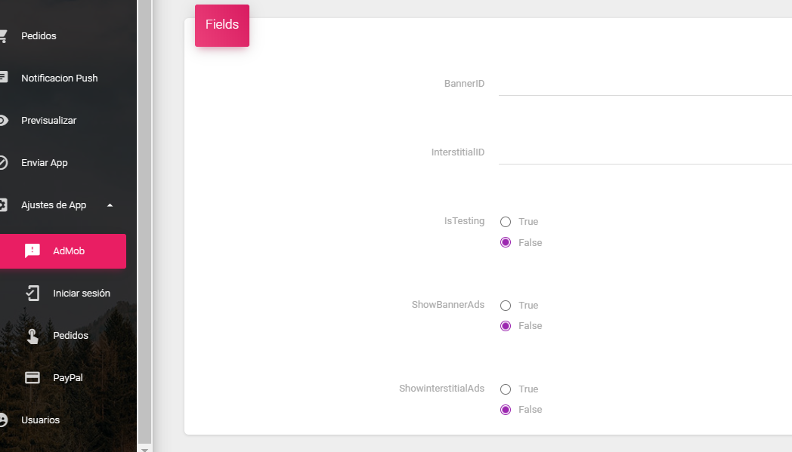

# Ajuste de la App

## Admob

Desde aquí puede administrar y cambiar  las configuración de anuncios que incluye estas opciones \[BannerID, InterstitialID, IsTesting, ShowBannerAds, ShowinterstitialAds\] 

En este enlace puede crear su banner y anuncios intersticiales. Cuando tenga los identificadores, configúrelos en BannerId e InterstitialId.

