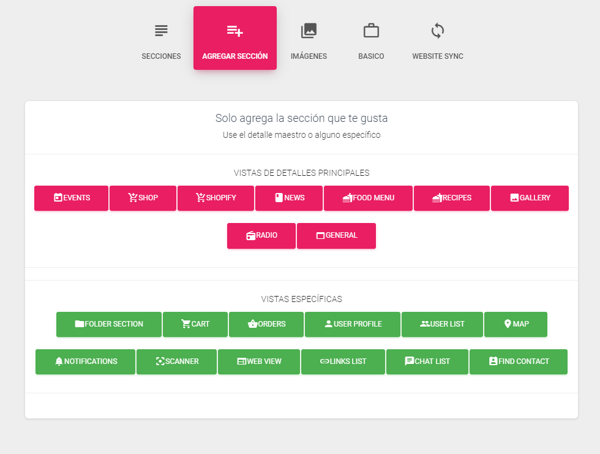

# Administra la aplicación

Al hacer clic en la aplicación, accederá a la configuración de la aplicación y allí tendrá opciones para previsualizar sus secciones, agregar nuevas secciones y cambiar los conceptos básicos, como cambiar las imágenes de la aplicación, el nombre y la identificación del paquete.

**Secciones**

Si desea cambiar el orden de cómo se enumera la sección, puede hacerlo arrastrando y soltando la sección como en la imagen a continuación.

**Agregar Secciones**

Al hacer clic en Agregar sección, puede agregar la sección adicional que necesita. Tienes 2 opciones de secciones

* **Vista detalles principales** - eventos, tienda, menú de comida, receta, galería, radio y general \(el que desea personalizar según sus necesidades\).
* **Vistas especificas** - sección de carpeta, carrito, pedidos, perfil de usuario, lista de usuarios, mapa, notificaciones, escáner, vista web, lista de enlaces.

Cuando hace clic en la sección, debería aparecer una alerta que dice que la nueva sección se agregó correctamente, como en la imagen a continuación.

Configuraciones de sección

Al hacer clic en el ícono de ajustes en la sección, este es el ícono de configuración, se abrirá una vista completamente nueva donde puede seleccionar una configuración diferente para este menú. Mira la foto de abajo....

Cuando hace clic en el icono, debería abrir una vista como esta en la imagen a continuación.

Aquí puedes cambiar:

* Configuracion Basica:
* icono
* Mostrar categoria
* si es menu raiz
* estilo de lista
* Nombre del menu
* secciones
  * **Configuracion** de categoria
  * Configuración de listado
  * Detalles de configuración

