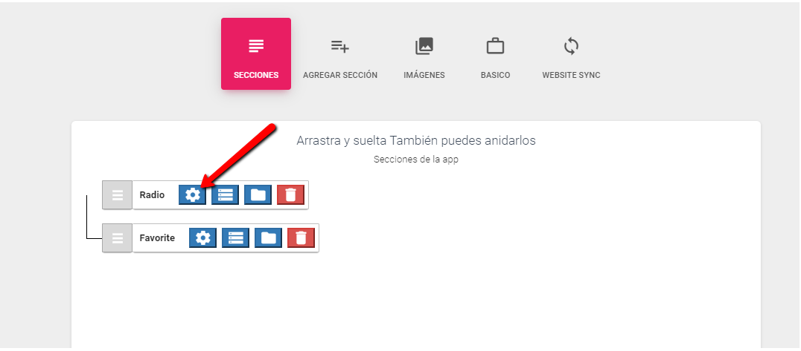
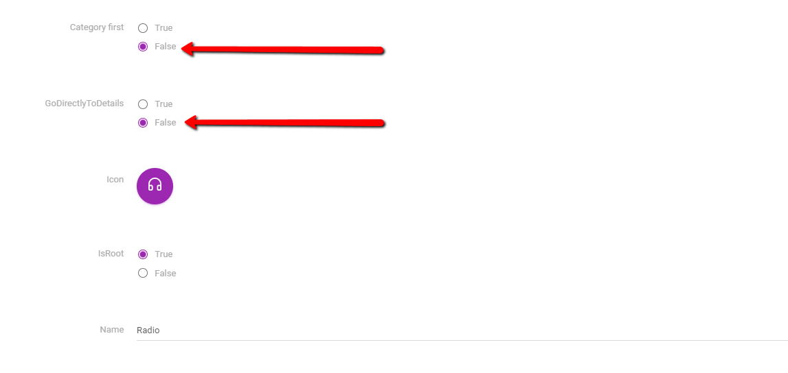
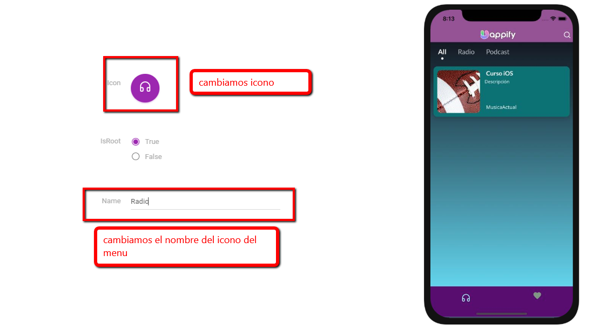
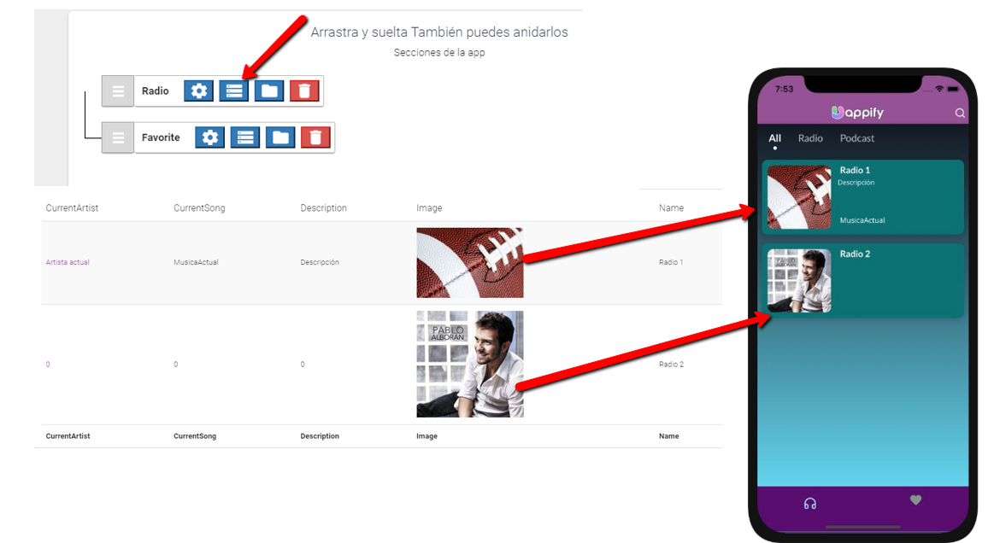

# Configuración de la app de radio

En esta sección, explicamos las cosas comunes que puede hacer a un determinado componente / plantilla.

## Artículo de inicio / Caso de uso - Aplicación de radio 

En la aplicación de radio, hay dos métodos

1. Estación de radio múltiple
2. Estación de radio individual

Para que se muestra la radio es necesario cambiar una configuración que viene por defecto ingresando en el botón de **Configuración**

Cambiamos **Category first** y **GoDirectlyToDetails** a **False,** tal como se muestra en la imagen

## Configuarando Icono y nombre

## Puedes añadir tantas radios como requieras

