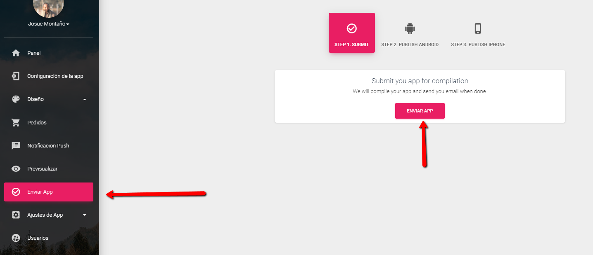
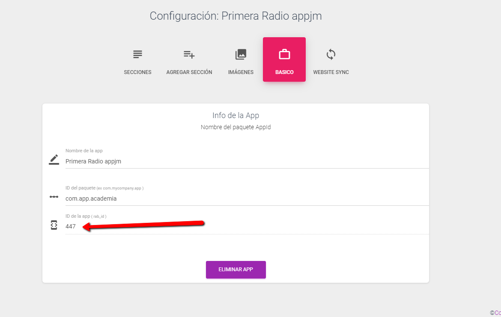
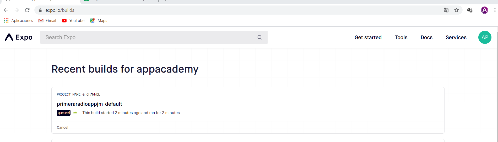
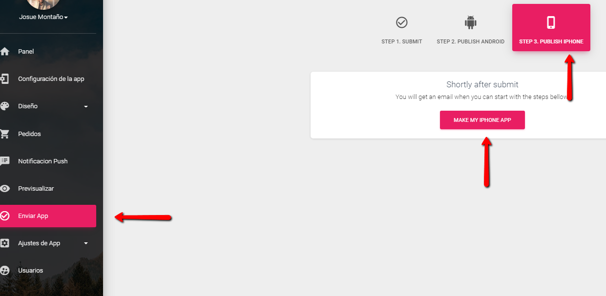

# Enviar aplicación para creación

Para enviar su aplicación a compilar, haga clic en "Enviar aplicación"

Tomar nota del id de la App 

### Compilar la app en Git



Terminado el Proceso pueden visualizar su app en [https://expo.io/builds](https://expo.io/builds), pueden probarla desde el dispositivo móvil

 Para la aplicación de iPhone. Necesitaremos algunas cosas adicionales de tu lado.

